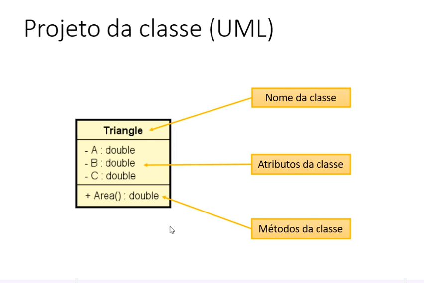
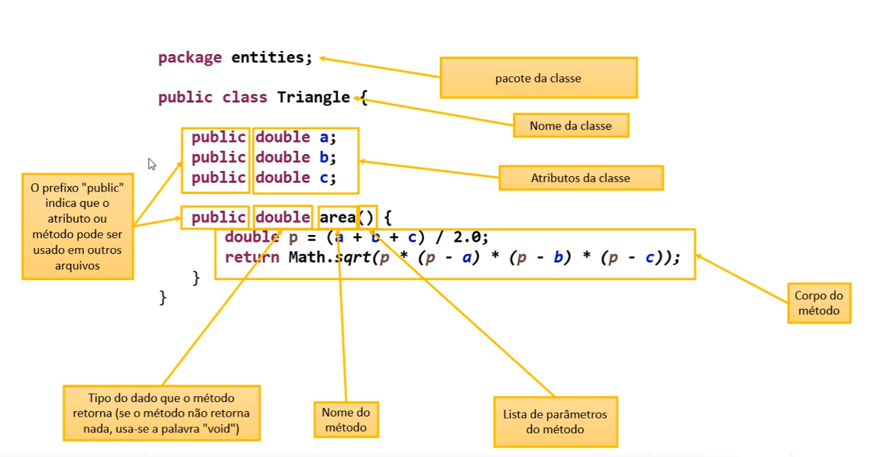

# Seção 8: Introdução à Programação Orientada a Objetos (POO) 🚀

Nesta etapa, dei o primeiro grande passo para além do paradigma procedural, explorando a **Programação Orientada a Objetos**. O foco foi aprender como organizar o código em classes, delegar responsabilidades e utilizar membros estáticos.

---

## 🧠 Conceitos Chave Explorados

### 1. Anatomia e Estrutura de uma Classe
A classe funciona como um "molde" para criar objetos. Ela define atributos (dados) e métodos (comportamentos). Nesta seção, aprendi a identificar e criar:
* Modificadores de acesso (`public`).
* Tipos de retorno e métodos que não retornam nada (`void`).
* Lista de parâmetros.

### 2. Separação de Camadas (Organização de Pacotes)
Passei a adotar a arquitetura baseada na separação de responsabilidades (camadas). Isso evita conflitos de nomes e deixa o projeto mais organizado.

* **`entities`**: Onde moram os dados e a lógica de negócio do objeto.
* **`application`**: Onde fica o programa principal (`main`), responsável pela interação com o usuário (leitura/saída de dados).

### 3. Delegação e Reaproveitamento
Entendi que o programa principal não deve carregar a lógica de cálculos complexos. Delegamos essa responsabilidade para a própria classe.
* *Exemplo:* A classe `Triangle` possui o método `area()`, eliminando a repetição da Fórmula de Heron no `main`:
    $$Area = \sqrt{p(p-a)(p-b)(p-c)}$$

### 4. Membros Estáticos (`static`)
Utilizei membros estáticos para criar classes utilitárias (como a `Calculadora` e o `ConversorMoeda`), que podem ser chamadas diretamente pelo nome da classe, sem a necessidade de dar um `new`. Ótimo para constantes e funções matemáticas universais.

---

## 📂 Exercícios e Projetos

| Pasta | Descrição do Problema | Conceitos Aplicados |
| :--- | :--- | :--- |
| `ex01_triangulo` | Comparação de áreas de triângulos (procedural vs POO). | Intro à POO, Atributos, Métodos, Delegação. |
| `ex02_estoque` | Sistema básico de gestão de produtos. | `toString`, manipulação de estado, `this`. |
| `ex03_retangulo` | Cálculo de área, perímetro e diagonal. | Lógica matemática dentro da classe. |
| `ex04_funcionario` | Gestão de salários e reajustes. | Atributos e comportamento. |
| `ex05_aluno` | Verificação de aprovação e notas trimestrais. | Condicionais na entidade. |
| `ex06_static` | Cálculos de esfera (circunferência/volume). | Membros estáticos e constantes. |
| `ex07_conversor` | Conversor de dólar para real com IOF (6%). | Classes utilitárias, `static`, `final`. |

---

## 🛠️ Ferramentas
* **Linguagem:** Java (v11+)
* **IDE:** VS Code (Java Pack)
* **Controle:** Git / GitHub