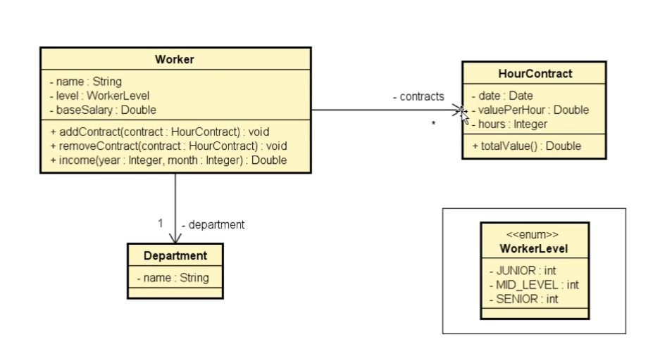

# 💼 Exercício 01: Sistema de Contratos e Cálculo de Renda

Projeto desenvolvido como parte dos estudos do capítulo de **Enumerações e Composição** (Seção 12 do curso de Java POO). O objetivo é registrar os dados de um funcionário, seus contratos por hora e calcular sua renda total para determinado mês e ano.

---

## 📑 Sumário
- [Descrição do Problema](#-descrição-do-problema)
- [Diagrama de Classes (UML)](#-diagrama-de-classes-uml)
- [Estrutura do Projeto](#-estrutura-do-projeto)
- [Conceitos e Tecnologias Aplicadas](#-conceitos-e-tecnologias-aplicadas)

---

## 📌 Descrição do Problema

Ler os dados de um trabalhador com N contratos (N fornecido pelo usuário). Depois, solicitar do usuário um mês e um ano (no formato `MM/YYYY`) e mostrar o salário do funcionário nesse mês, considerando o seu **salário base** somado com o **valor total de cada contrato** realizado naquele mês e ano específicos.

---

## 📐 Diagrama de Classes (UML)


---

## 📂 Estrutura do Projeto

```text
src/
└── sc12_enumeracao_composicao/
    └── exercicio1/
        ├── application/
        │   └── Program.java
        ├── entities/
        │   ├── ContratoPorHora.java
        │   ├── Departamento.java
        │   └── Funcionario.java
        └── entities_enum/
            └── Level.java
```

---

## 🛠️ Conceitos e Tecnologias Aplicadas

- **Enumerações (`enum`)**: Definição da constante de nível do funcionário (`JUNIOR`, `MID_LEVEL`, `SENIOR`) garantindo integridade dos dados.
- **Composição de Objetos**:
  - `Funcionario` **tem um** `Departamento` (Relacionamento 1 para 1).
  - `Funcionario` **tem vários** `ContratoPorHora` (Relacionamento 1 para N, manipulado via `List<ContratoPorHora>`).
- **Manipulação Moderna de Datas (Java 8+)**:
  - `LocalDate`: Armazenamento de datas nos contratos de forma segura e sem fuso horário.
  - `DateTimeFormatter`: Formatação e parse de datas no padrão brasileiro (`dd/MM/yyyy` e `MM/yyyy`).
  - `YearMonth`: Parsing da competência informada pelo usuário, substituindo o uso manual de `substring`.

---

```text
Exemplo de entrada/saída:
----------------------------------------
Digite o nome do departamento: Design
Nome do funcionário: Alex
Level: MID_LEVEL
Sálario base: 1200.00
Quantos contratos esse funcionário vai ter? 3
Digite os dados do contrato 1:
Data (DD/MM/YYYY): 20/08/2018
Valor por hora: 50.00
Digite a duração em horas: 20
...
Digite o mês e ano para calcular o salário (MM/YYYY): 08/2018

Nome: Alex
Departmento: Design
Salário na data 08/2018: 3000.00
```