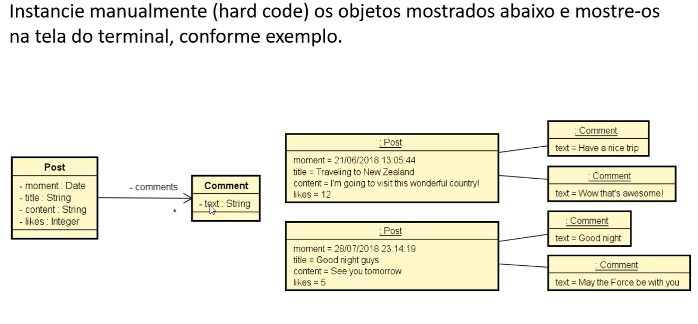

# Exercício 2: StringBuilder (Composição)

## 📝 Descrição do Projeto
A aplicação simula um sistema básico de rede social onde uma publicação (**Post**) contém múltiplos **Comentários**. Os dados foram instanciados manualmente no programa principal (hard code) para focar na correta estruturação das classes e na exibição formatada dos dados no terminal utilizando a classe `StringBuilder`.

## 📊 Diagrama de Classes

> **⚠️ Nota Importante sobre o Diagrama:** 
> O diagrama original especifica o uso da classe `Date` (legada) para o atributo *moment* da classe `Post`. No entanto, **optei por utilizar a classe `Instant`**. Essa mudança foi feita porque a API `java.time` (introduzida no Java 8) é o padrão moderno, mais seguro e recomendado pelas boas práticas atuais do mercado para manipulação de datas e fusos horários no Java, substituindo a antiga e problemática `java.util.Date`

* **Entidades:**
  * `Post`: Representa a publicação, contendo data/hora (`Instant`), título, conteúdo e quantidade de curtidas (likes).
  * `Comentario`: Representa a resposta dos usuários, contendo apenas o texto.
* **Relacionamentos:** 
  * Associação de **Um para Muitos (1..*)**: Um `Post` possui uma lista de `Comentario`.

## 🛠️ Tecnologias e Conceitos Utilizados
* **Java:**
  * API de Datas (`java.time.Instant`, `java.time.format.DateTimeFormatter` e `java.time.ZoneId`).
  * Coleções (`java.util.List`, `java.util.ArrayList`).
  * `StringBuilder` para otimização da geração e concatenação do texto de saída no método `toString()`.
* **Orientação a Objetos:**
  * Encapsulamento, Construtores e Delegação de responsabilidades.
  * Composição de Objetos.
