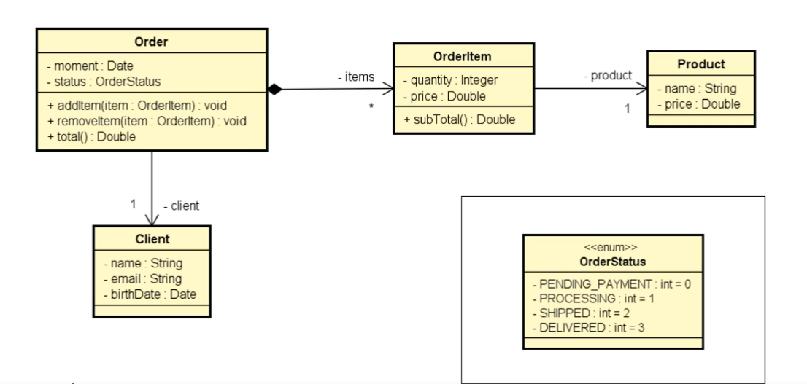
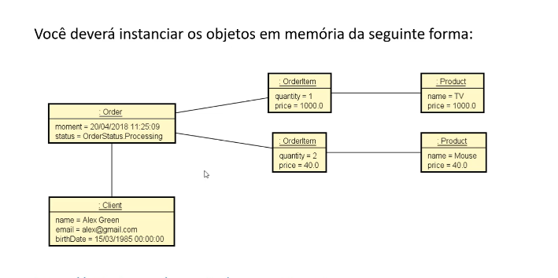

# Exercício 3: Sistema de Pedidos (Composição e Enumeração)

## 📝 Descrição do Projeto
Desafio final simulando um sistema de vendas (e-commerce).

O programa lê os dados de um cliente, o status de um pedido e os dados de múltiplos itens escolhidos (produto, quantidade e preço). Ao final, o sistema instancia todos os objetos, amarra os relacionamentos na memória e exibe um extrato completo do pedido utilizando o padrão de delegação com `StringBuilder`.

## 📊 Diagrama de Classes
Modelagem UML do sistema, demonstrando as relações de associação e composição (1 para 1 e 1 para N).

## 🧩 Relacionamento de Objetos na Memória
Representação visual de como as instâncias se conectam durante a execução do programa.

## 💻 Exemplo de Execução
Entrada de dados via terminal e a saída formatada do extrato gerado pelo objeto `Pedido`.

## 🛠️ Tecnologias Utilizadas
* **Java:** API `java.time` (`LocalDate`, `LocalDateTime`, `DateTimeFormatter`), Coleções (`List`, `ArrayList`) e classe `StringBuilder`.
* **Orientação a Objetos:** Classes, Atributos, Construtores, Getters/Setters, Enumerações (`enum`) e Delegação do método `toString()`.

