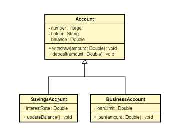

# 🏛️ Sistema Bancário: Herança e Polimorfismo (Capítulo 13)

Este diretório contém a evolução de um sistema bancário construído em Java, focado em demonstrar na prática os pilares da Programação Orientada a Objetos.

## 📊 Estrutura e Diagrama UML

O sistema é estruturado na seguinte hierarquia de herança (relação "é um"):

* **`Conta` (Superclasse / Classe Base):** * Contém os dados e comportamentos comuns a todas as contas (`numero`, `titular`, `saldo`, `saque()`, `depositar()`). 
  * Utiliza o modificador **`protected`** no `saldo` para permitir que subclasses acedam a este valor.
* **`ContaEmpresa` (Subclasse):** * Herda (`extends`) da classe `Conta` e usa `super()` no construtor.
  * Adiciona a regra de negócio exclusiva para empresas: `limiteEmprestimo` e a função `emprestimo()`.
* **`ContaPoupanca` (Subclasse):**
  * Herda de `Conta`.
  * Adiciona a regra exclusiva de poupança: `taxaDeJuros` e o método `atualizarSaldo()`.

> **Visualização do Diagrama Atualizado:**
> 

---

## 🧠 Evolução 1: Casting e Verificação de Tipos

Nesta nova fase do projeto, implementámos lógicas para testar a flexibilidade do polimorfismo e as conversões de tipos na memória:

### 1. Upcasting
Casting da subclasse para a superclasse (subir na hierarquia).
* **Segurança:** 100% seguro e implícito (Toda Conta Empresa *é uma* Conta).
* **Exemplo:** `Conta c = new ContaEmpresa(...);` 

### 2. Downcasting
Casting da superclasse para a subclasse (descer na hierarquia).
* **Uso:** Necessário quando precisamos de aceder a métodos específicos da subclasse (ex: `emprestimo()`) a partir de uma variável genérica da superclasse.
* **Segurança:** Exige casting explícito `(Tipo)` e pode causar `ClassCastException` se o objeto na memória não for realmente daquela classe.

### 3. Proteção com `instanceof`
Para evitar que o programa bloqueie ou crashe ao fazer Downcasting, usamos a palavra reservada `instanceof`. Ela atua como um segurança, fazendo uma verificação de tipo (`True` / `False`) antes da conversão:

```java
if (contaExemplo3 instanceof ContaPoupanca) {
    // Só entra aqui se o objeto no Heap for realmente uma ContaPoupanca
    ContaPoupanca acc = (ContaPoupanca) contaExemplo3;
    acc.atualizarSaldo();
}