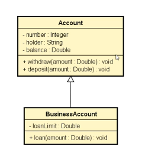

# 🏛️ Capítulo 13: Herança e Polimorfismo

Este diretório contém os códigos introdutórios sobre **Herança** em Java, ilustrando como reaproveitar código e estabelecer relações do tipo "é um" entre objetos.

## 📊 Diagrama UML - Herança

O código baseia-se na seguinte estrutura e relacionamento:

* **`Conta` (Superclasse / Classe Base):** * Contém os dados e comportamentos comuns a todas as contas (`number`, `titular`, `saldo`, `saque()`, `depositar()`). 
    * Utiliza o modificador de acesso **`protected`** no `saldo` para permitir que subclasses acessem esse valor.
* **`ContaEmpresa` (Subclasse / Classe Filha):** * Herda (`extends`) toda a estrutura da classe `Conta`. 
    * Adiciona comportamentos e dados específicos de empresas (`LimiteEmprestimo` e a função `limite()`).
    * Utiliza a palavra **`super`** para repassar os dados ao construtor da superclasse.

> **Visualização do Diagrama:**
>  
